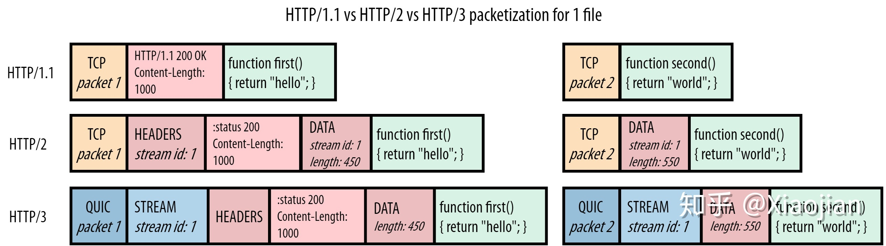
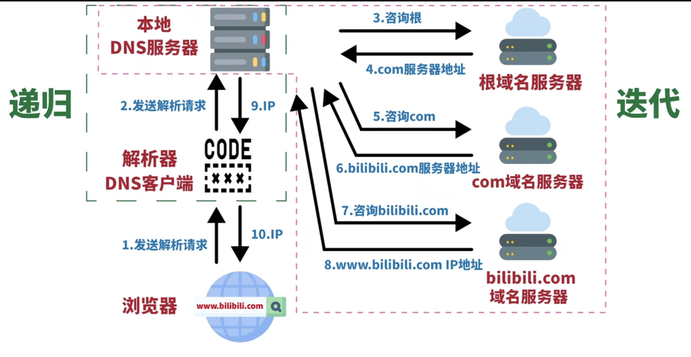

## HTML

### html 5

- 新的语义元素，比如 `<header>`, `<footer>`, `<article>`, `<section>`。
- 新的表单控件，比如数字、日期、时间、日历和滑块。
- 强大的图像支持（借由 `<canvas>` 和 `<svg>`）
- 强大的多媒体支持（借由 `<video>` 和 `<audio>`）
- 强大的新 API，比如用本地存储取代 cookie。

### WEB标准以及W3C标准是什么?

- 标签闭合、标签小写、不乱嵌套、使用外链css和js、结构行为表现的分离

## CSS

### Margin塌陷

解决方法 OFPD

1. `float`属性为`left`/`right`
2. `overflow`为`hidden`/`scroll`/`auto`
3. `position`为`absolute`/`fixed`
4. `display`为`inline-block`/`table-cell`/`table-caption`

**Block Formatting Contex**，中文叫块级格式上下文。

居中的几种方法

行内元素，给其父元素设置 text-align:center

块级元素， margin:0 auto

### 伪类

:checked fullscreen hover nth-child nth-last-child

## Network

### HTTP

TLS四次握手

**第1次握手**

Client Hello

发送TLS版本 多种加密套件 随机数1

**第2次握手**

Server Hello

确认TLS版本 选择加密套件 随机数2

Certificate

出示服务器证书

Server Key Exchange

发送公钥

Server Hello Done

**第3次握手**

Client Key Exchange

生成预主秘钥 用公钥加密发送

Change Cipher Spec, Encrypted Handshake Message

**第4次握手**

Encrypted Handshake Message

### 常见HTTP状态码

| 状态码                   | 含义                                                         |
| ------------------------- | ------------------------------------------------------------ |
| 101 Switching Protocol    | 服务器应客户端升级协议的请求                                 |
| 200 OK                    | 表明请求已经成功                                             |
| 201 Created               | 创建了新的资源                                               |
| 204 No Content            |                                                              |
| 301 Moved Permanently     | 请求的资源已经被移动到了由 [`Location`](https://developer.mozilla.org/zh-CN/docs/Web/HTTP/Headers/Location) 头部指定的 url 上，是固定的不会再改变 |
| 302 Found                 | 请求的资源被暂时的移动到了由该 HTTP 响应的响应头 [`Location`](https://developer.mozilla.org/zh-CN/docs/Web/HTTP/Headers/Location) 指定的 URL 上 |
| 304 Not Modified          | 无需再次传输请求的内容，可以使用缓存的内容                   |
| 400 Bad Request           | 语法错误                                                     |
| 401 Unauthorized          | 缺乏目标资源要求的身份验证凭证                               |
| 403 Forbidden             | 权限不足，服务器端有能力处理该请求，但是拒绝授权访问         |
| 404 Not Found             | 服务器无法找到所请求的资源                                   |
| 500 Internal Server Error | 服务器端错误                                                 |
| 502 Bad Gateway           |                                                              |
| 503 Service Unavailable   | 超载或维护                                                   |

### AJAX

### HTTP/1.1 HTTP/2 HTTP/3

**HTTP/1.1**

HTTP队头阻塞 默认持久连接（Keep-Alive）

pipeline管线化 单个连接可以发送多个请求 接收顺序需按照请求顺序

减少请求的方法：CSS雪碧图、图片Base64编码、域名分片、JS和CSS合并、CSS和JS整合到HTML

**HTTP2**

多路复用

交错发送请求和响应

请求和响应报文被划分为不同的帧 帧分为首部帧和数据帧

流标识符（Stream ID）

首部压缩 HPACK

浏览器推送

无法解决TCP的队头阻塞

### HTTP3

应用层数据封装成QUIC帧

流标识符

QUIC帧封装成QUIC数据包

连接ID

**QUIC 在单个资源流中保留了顺序，但不再跨单个流（individual streams）进行排序**。

### DNS

顶级域名服务器 Top Level Domain（TLD）com cn net gov

权限域名服务器 Authoritative bilibili qq baidu

## Front-end Security

**CSRF**

**方案一：放弃Cookie、使用Token！**

由于CSRF是通过Cookie伪造请求的方式，欺骗服务器，来达到自己的目的。那么我们采取的策略就是，不使用Cookie的方式来验证用户身份，我们使用Token！

Token的策略，一般就是登陆的时候，服务端在response中，返回一个token字段，然后以后所有的通信，前端就把这个token添加到http请求的头部。

这是当前，最常用的防御CSRF攻击的策略。

**方案二：SameSite Cookies**

前端在发展，Cookie也在进化，Cookie有一个新的属性——SateSite。能够解决CSRF攻击的问题。

它表示，只能当前域名的网站发出的http请求，携带这个Cookie。

当然，由于这是新的cookie属性，在兼容性上肯定会有问题。

**XSS** 跨站脚本攻击

**方案一：http-only**

Cookie有一个http-only属性，表示只能被http请求携带。

假如你的网站遭受到XSS攻击，攻击者就无法通过document.cookie得到你的cookie信息。
